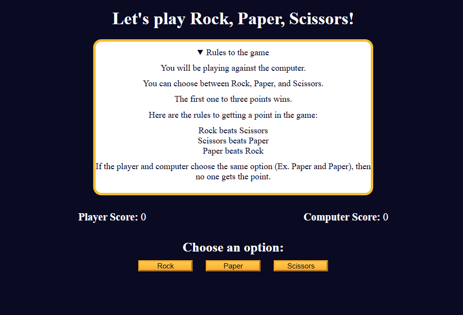

# 🎯 Rock Paper Scissors Game

Welcome to the **Rock Paper Scissors Game**! 🪨📄✂️
A fun, interactive web game where you play against the computer to see who reaches 3 points first! 🔥

## 🚀 Features
- Random computer choices 🤖
- Score tracking 🔢
- First to reach 3 points wins 🏆
- Reset game functionality 🔄
- Dynamic UI updates 💪

## 🛠️ Technologies Used
- HTML 🌐
- CSS 🎨
- JavaScript ⚙️

## 🎯 How to Play
1. Choose **Rock**, **Paper**, or **Scissors** by clicking the buttons.
2. The computer will randomly select its option.
3. The result of the round will be displayed.
4. First player to reach **3 points** wins the game!
5. Click the **Reset** button to play again.

## 📌 Game Rules
| Player Choice   | Computer Choice | Result          |
|----------------|----------------|---------------|
| Rock 🪨        | Scissors ✂️    | Player Wins ✅ |
| Paper 📄       | Rock 🪨        | Player Wins ✅ |
| Scissors ✂️    | Paper 📄       | Player Wins ✅ |
| Same Choice    | Same Choice    | It's a Tie 🤝  |

## 🧠 How It Works
- The game uses **Math.random()** to generate computer choices.
- Score is updated dynamically using **innerText**.
- Winner message is displayed when a player reaches **3 points**.
- The **Reset** button restarts the game.

## 📸 Screenshot


## 🔑 How to Run
1. Clone the repo 📥
```bash
https://github.com/yamneg96/Web-Projects-FCC/tree/main/JavaScript_Algorithms_and_Data_Structures/G1/p6
```
2. Open `index.html` in your browser 🌐

## 🎉 Enjoy Playing! 🥳

---

